# Design Patterns — Complete Visual Reference

A comprehensive visual map of all **152** design patterns implemented in this repository, organized by category.

> For pattern source code, browse each module directory. For the website, visit [java-design-patterns.com](https://java-design-patterns.com/patterns/).

---

## Pattern Landscape

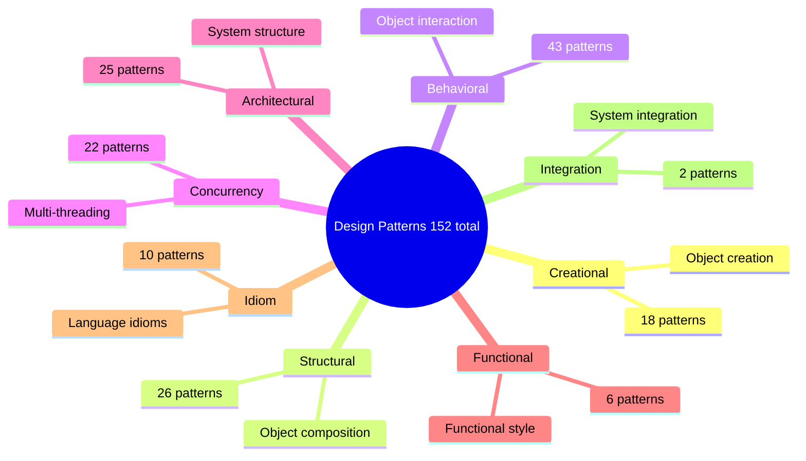

---

## Creational Patterns
*18 patterns — focused on object creation mechanisms, aiming to create objects suited to the situation.*

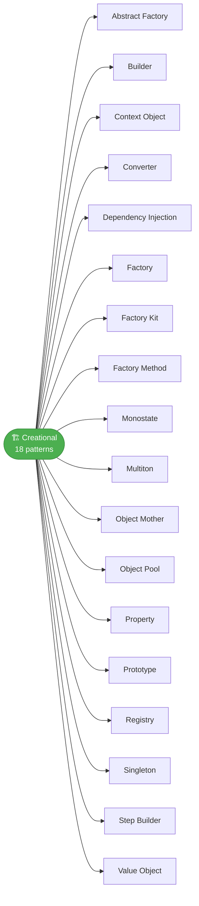

---

## Structural Patterns
*26 patterns — focused on how classes and objects are composed to form larger structures.*

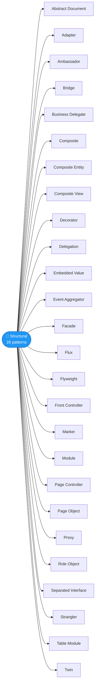

---

## Behavioral Patterns
*43 patterns — focused on communication and responsibility between objects.*

```mermaid
flowchart LR
    B([🔄 Behavioral\n43 patterns])

    B --> AV[Acyclic Visitor]
    B --> BC[Bytecode]
    B --> CA[Caching]
    B --> CR[Chain of Responsibility]
    B --> CB[Circuit Breaker]
    B --> CM[Command]
    B --> DL[Data Locality]
    B --> DF[Dirty Flag]
    B --> DB[Double Buffer]
    B --> EO[Extension Objects]
    B --> FT[Feature Toggle]
    B --> GL[Game Loop]
    B --> IM[Identity Map]
    B --> IF[Intercepting Filter]
    B --> IN[Interpreter]
    B --> IT[Iterator]
    B --> LE[Leader Election]
    B --> ME[Mediator]
    B --> MM[Memento]
    B --> NO[Null Object]
    B --> OB[Observer]
    B --> PA[Parameter Object]
    B --> PR[Partial Response]
    B --> PI[Pipeline]
    B --> PP[Poison Pill]
    B --> PM[Presentation Model]
    B --> PQ[Priority Queue]
    B --> RT[Retry]
    B --> SV[Servant]
    B --> SH[Sharding]
    B --> SP[Spatial Partition]
    B --> SC[Special Case]
    B --> SF[Specification]
    B --> ST[State]
    B --> SG[Strategy]
    B --> SS[Subclass Sandbox]
    B --> TM[Template Method]
    B --> TH[Throttling]
    B --> TR[Trampoline]
    B --> TS[Transaction Script]
    B --> TO[Type Object]
    B --> UM[Update Method]
    B --> VI[Visitor]

    style B fill:#FF9800,color:#fff,stroke:#E65100
```

---

## Concurrency Patterns
*22 patterns — focused on multi-threaded and parallel programming.*

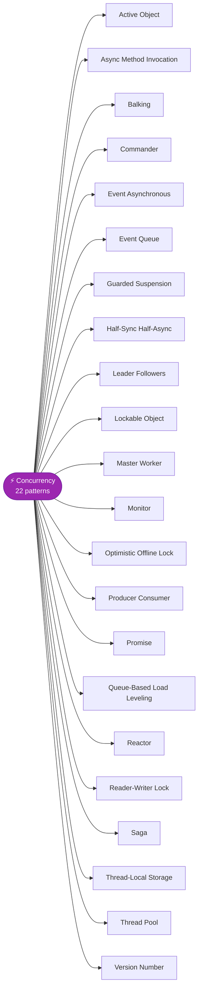

---

## Architectural Patterns
*25 patterns — focused on the overall structure and organization of a system.*

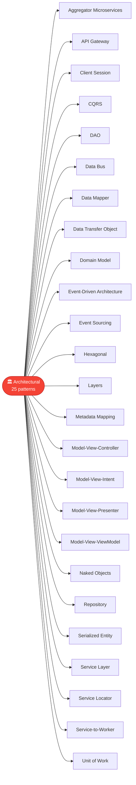

---

## Functional Patterns
*6 patterns — focused on functional programming principles in an OO context.*

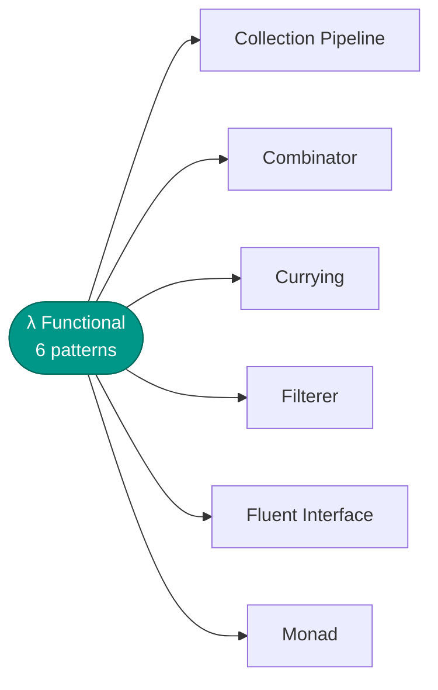

---

## Idiom Patterns
*10 patterns — language-specific patterns and coding conventions for Java.*

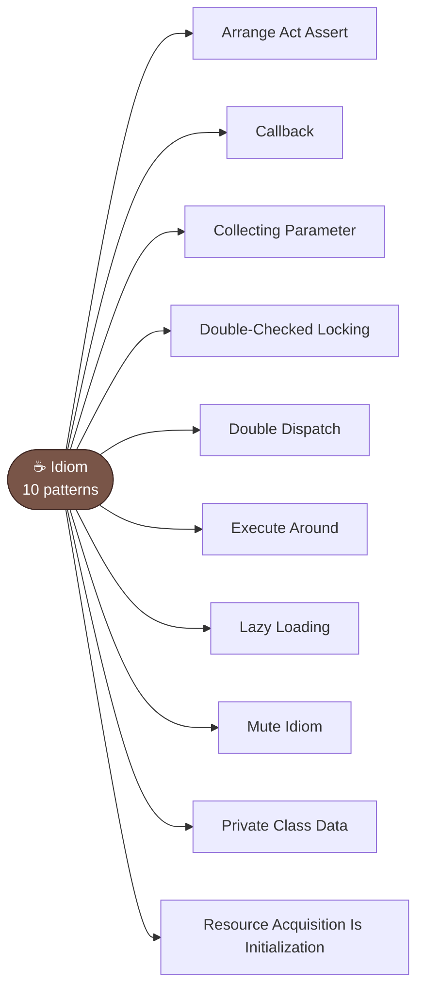

---

## Integration Patterns
*2 patterns — focused on integrating systems and services.*

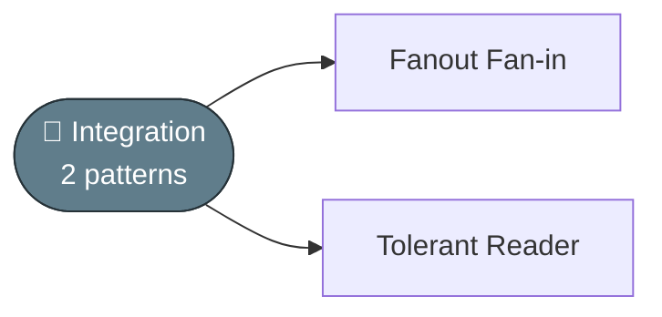

---

## Pattern Count by Category

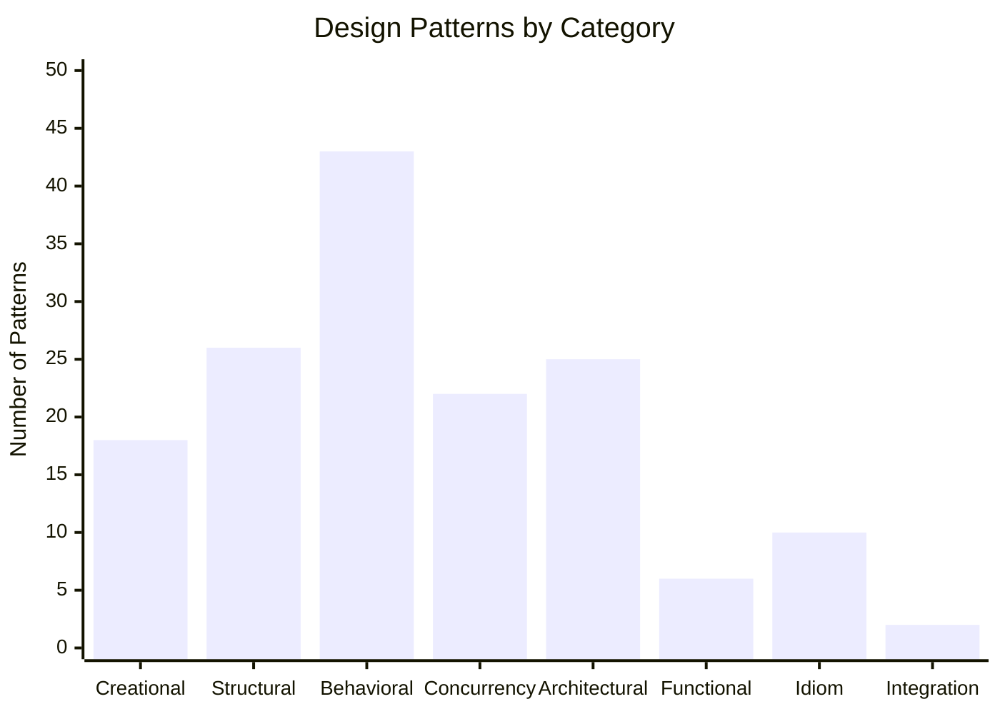

---

## GoF Patterns at a Glance

The original 23 Gang of Four patterns, mapped across the three classic GoF categories:

```mermaid
flowchart TD
    GoF([Gang of Four\n23 Classic Patterns])

    GoF --> CR[Creational]
    GoF --> ST[Structural]
    GoF --> BH[Behavioral]

    CR --> AF[Abstract Factory]
    CR --> BU[Builder]
    CR --> FM[Factory Method]
    CR --> PT[Prototype]
    CR --> SG[Singleton]

    ST --> AD[Adapter]
    ST --> BR[Bridge]
    ST --> CO[Composite]
    ST --> DE[Decorator]
    ST --> FA[Facade]
    ST --> FW[Flyweight]
    ST --> PR[Proxy]

    BH --> CR2[Chain of Responsibility]
    BH --> CM[Command]
    BH --> IT[Iterator]
    BH --> ME[Mediator]
    BH --> MM[Memento]
    BH --> OB[Observer]
    BH --> SA[State]
    BH --> SV[Strategy]
    BH --> TM[Template Method]
    BH --> VI[Visitor]
    BH --> IN[Interpreter]

    style GoF fill:#212121,color:#fff,stroke:#000
    style CR fill:#4CAF50,color:#fff,stroke:#388E3C
    style ST fill:#2196F3,color:#fff,stroke:#1565C0
    style BH fill:#FF9800,color:#fff,stroke:#E65100
```
